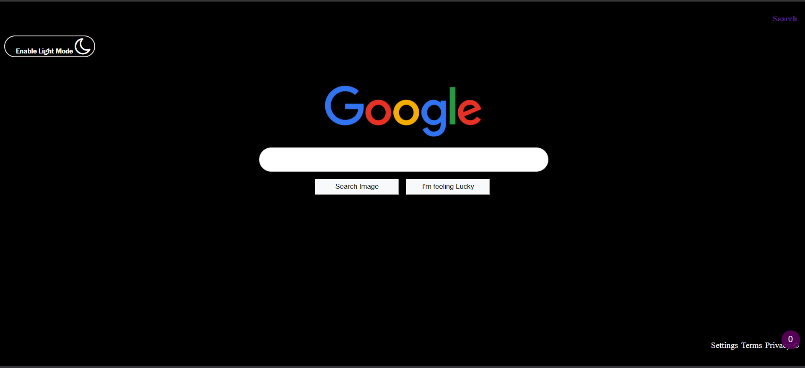
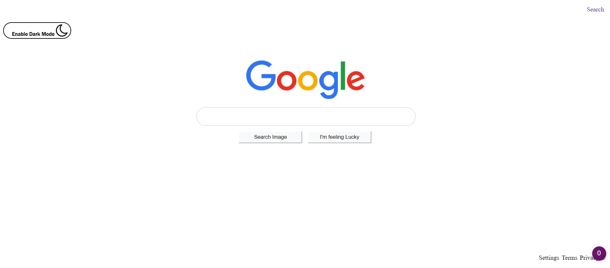

# Google-Search-EngineClone-Dark-Mode-Enable

<b>This project is all about creating a clone of google search engine.
With feature to enable dark mode and Light Mode as per requirement
It allows to switch between simple search and image search</b>

To get a better picture of how it works go through this video [https://youtu.be/usCFj34nEtM]
# Dark Mode

Dark Mode Enabled

# Light Mode

Light Mode Enabled

